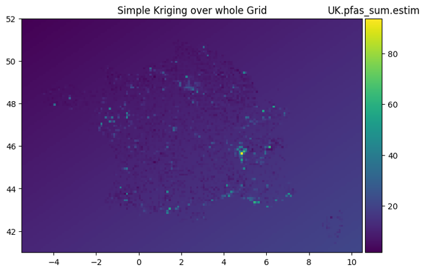

# Krigeage PFAS - Analyse Géostatistique de la Contamination par les PFAS

## Description

Ce projet étudie la contamination par les substances per- et polyfluoroalkylées (PFAS) dans l'environnement, en utilisant des techniques géostatistiques avancées telles que le krigeage. La présence persistante de PFAS dans des milieux variés (eaux de surface, eaux souterraines, etc.) soulève des préoccupations en matière de santé publique et d'écologie. Ce projet vise à modéliser spatialement leur distribution pour mieux comprendre les facteurs de dispersion de ces substances.

## Données

Les données sont issues du CNRS, incluant 131 jeux de données relatifs aux PFAS à l'échelle européenne. Les variables principales comprennent la catégorie du site, les coordonnées GPS, l'année de prélèvement, le type de milieu, et la concentration totale en PFAS (PFAS_sum). Des données complémentaires de pluviométrie ont été intégrées via l'API de Météo France.

## Méthodes

- **Exploration et Prétraitement** : Visualisation des données dans Power BI et segmentation par type d'eau (eau potable, souterraine et de surface).
- **Modélisation par Krigeage** :
  - **Krigeage Simple** : Estimation basique des concentrations.
  - **Krigeage Ordinaire** : Modèle de moyenne locale.
  - **Krigeage Universel** : Modélisation avancée intégrant des polynômes pour la moyenne.
- **Cokrigeage (non retenu)** : Inclusion de variables auxiliaires (distance aux sites industriels, pluviométrie) pour la dispersion des PFAS.

## Résultats

Les techniques de krigeage ont permis d’identifier les zones à risque élevé de contamination par les PFAS, bien que les corrélations avec les distances aux sites industriels et la pluviométrie soient faibles. Ces résultats suggèrent que d'autres variables explicatives sont nécessaires pour une modélisation plus précise de la dispersion des PFAS.
